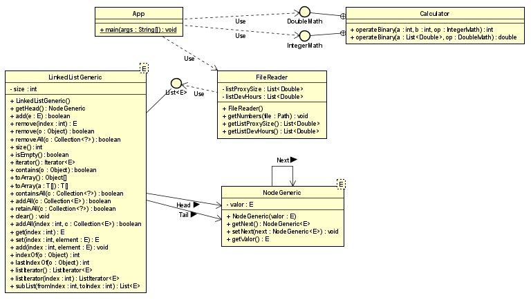
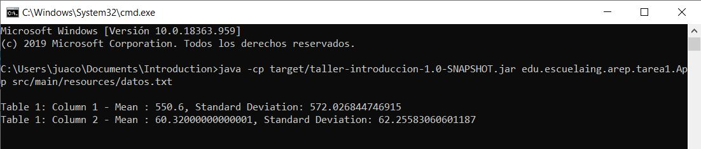
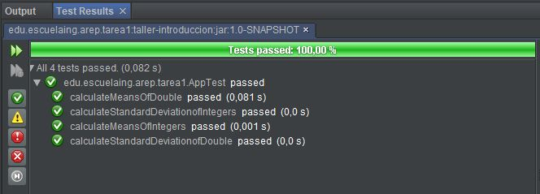
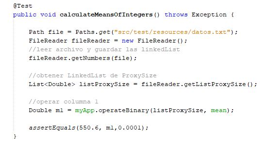
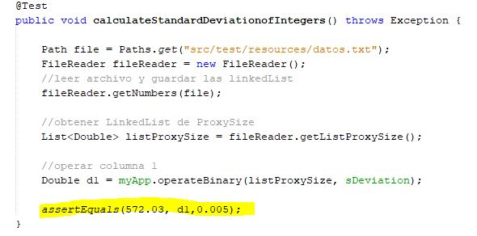
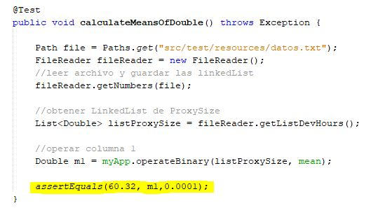
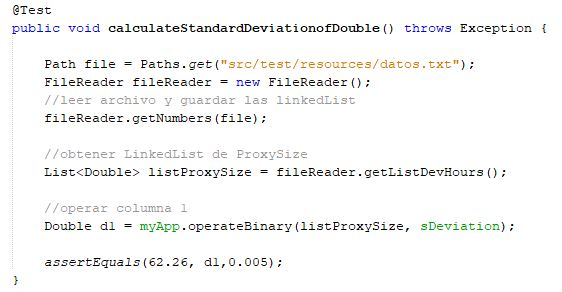

# HOMEWORK 1 AREM (INTRODUCTION TO COMPLEX SYSTEMS, JAVA, MVN, AND GIT)

Write a program to calculate the mean and standard deviation of a set of n real numbers.


# DESIGN


# START

Copy the project through git clone in any direction to start working:
```
git clone https://github.com/Juaco9502/INTRODUCTION-TO-COMPLEX-SYSTEMS-JAVA-MVN-AND-GIT---AREP.git
```

## PRE-REQUISITES

* Java jdk > 7
* Maven (Apache Maven)
* Git

## INSTALL

1. Run in terminal:

```
$$ mvn package
```
2.(Optional):
If you want to view the documentation of the application, execute the following command and check the following path: root / target:

```
mvn javadoc:javadoc
```

3. (Run):
The following command must be used in the project root folder:
  
```
java -cp target/taller-introduccion-1.0-SNAPSHOT.jar edu.escuelaing.arep.tarea1.App src/main/resources/datos.txt
```

  
## TEST REPORT

### TEST RESULT



## TEST REPORT

TEST 1 | TEST 2
------------ | ------------- 
 | 
En esta prueba se ingresaron los datos de la columna 1 --> calculandole su media| En esta prueba se ingresaron los datos de la columna 1 --> calculandole su Desviación Estandar

TEST 3 | TEST 4
------------ | ------------- 
 | 
En esta prueba se ingresaron los datos de la columna 2 --> calculandole su media| En esta prueba se ingresaron los datos de la columna 2 --> calculandole su Desviación Estandar


## BUILT

* [Maven](https://maven.apache.org/) - Dependency Management
* [JAVA JDK 8](http://www.oracle.com/technetwork/java/javase/overview/index.html) - Building
* [JUnit 3.8.1](https://mvnrepository.com/artifact/junit/junit/3.8.1) - Test


## AUTHOR

* **JUAN CAMILO ORTIZ MEDINA** - [Juaco9502](https://github.com/juaco9502)


## LICENSE

This project is licensed under the GNU General Public License - [LICENSE](LICENSE) 